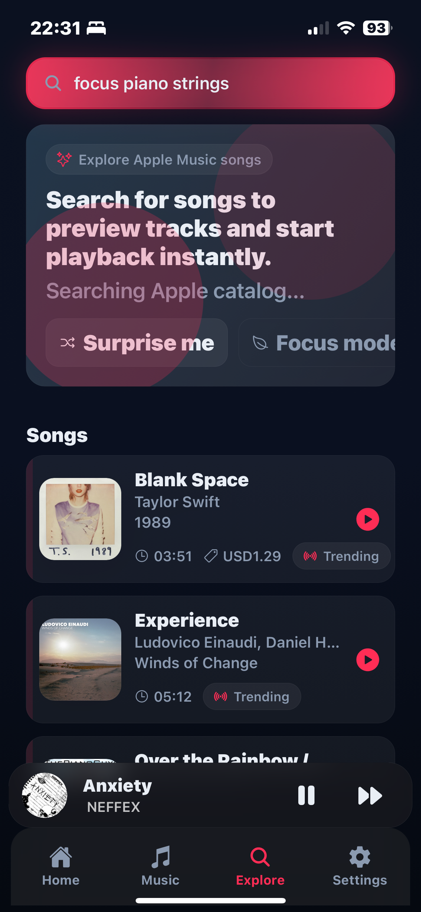
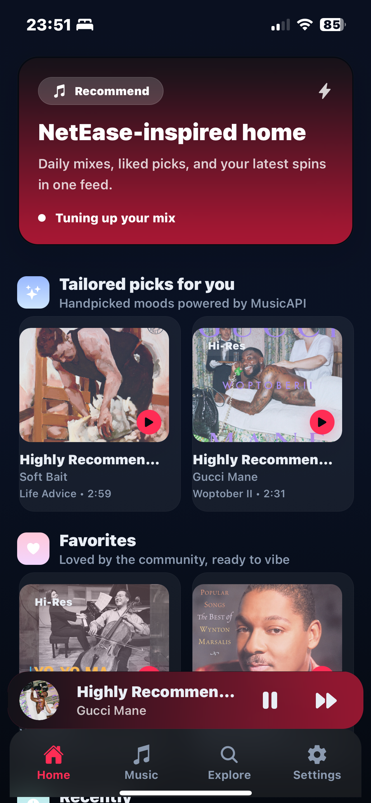
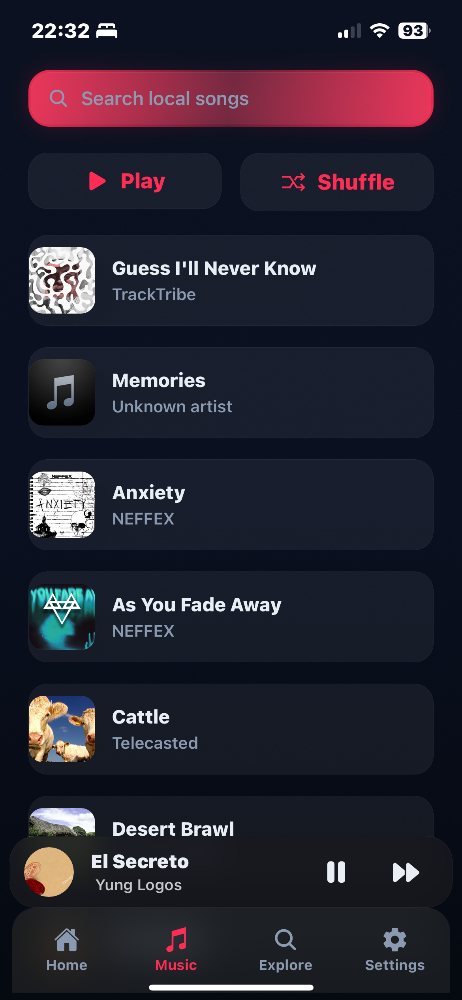
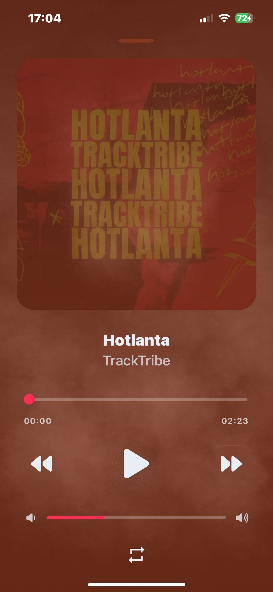

# NeteaseCloud Music Player

A NetEase- and Apple Music-inspired player built with Expo Router, React Native, and Zustand. Streams from MusicAPI with polished visuals and a feature-rich Now Playing experience.

## Features
- Home feed with tailored picks, favorites, and recently played sections powered by MusicAPI, plus quick queue actions.
- Fullscreen player with animated/blurred artwork backdrops, progress + volume bars, repeat toggle, and marquee titles.
- Library tab backed by bundled tracks in `assets/data/library.json`, including fuzzy search and remote search fallback.
- Explore tab that searches Apple Music previews, trending chips, curated mood queues, and “surprise me” shortcuts.
- Multilingual UI (English/中文), theme + accent picker (system/light/dark; Apple pink, ocean blue, mint, sunset).
- Zustand-driven queue and preferences; resumes your last active track and keeps playback in sync across tabs.

## Screenshots
<table style="width: 80%; margin: 0 auto;">
  <tr>
    <td></td>
    <td></td>
  </tr>
  <tr>
    <td></td>
    <td></td>
  </tr>
</table>

## Getting started
1. Install dependencies: `npm install`
2. Start Expo (choose web, Android, or iOS simulator/device): `npm start`
3. Optional scripts: `npm run android`, `npm run ios`, `npm run startc` (clear cache), `npm run type-check`, `npm run fix` (Biome format/lint)

Set `EXPO_PUBLIC_API_BASE_URL` if you want MusicAPI calls to target a different backend.

## Project structure
- `src/app`: Expo Router entry + tab screens (Home, Music library, Explore, Settings) and the `player` route.
- `src/components`: Reusable UI parts (controls, lists, overlays).
- `src/hooks`, `src/store`: Playback/library state, queue, preferences, and theming powered by Zustand hooks.
- `assets`: Images/fonts and the sample library used for offline-friendly playback.
